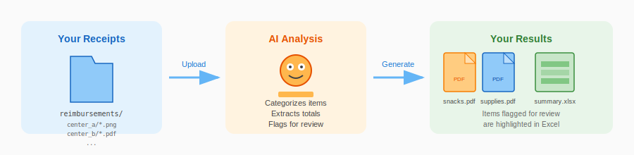

# Receipt Analyzer

Automatically categorize and organize childcare reimbursement receipts using AI.



## What It Does

Upload a ZIP file of receipt images/PDFs organized by center, and the app will:

1. **Analyze** each receipt using Claude Vision AI
2. **Categorize** items as Snacks or Supplies
3. **Generate** combined PDFs by category (`snacks.pdf`, `supplies.pdf`)
4. **Create** Excel summaries with totals and items flagged for review
5. **Package** everything into a downloadable ZIP

## Live Demo

Try it now: [rapid-receiptsanalyzer.streamlit.app](https://rapid-receiptsanalyzer.streamlit.app)

## Input Format

Your ZIP file should have this structure:

```
reimbursements/
├── Center A/
│   ├── receipt1.png
│   ├── receipt2.pdf
│   └── receipt3.jpg
├── Center B/
│   ├── walmart_receipt.png
│   └── target_receipt.pdf
└── Center C/
    └── ...
```

## Output

For each center, you'll get:

| File | Description |
|------|-------------|
| `snacks.pdf` | All food/snack receipts combined |
| `supplies.pdf` | All supply receipts combined |
| `summary_{center}.xlsx` | Excel report with totals, item details, and review flags |

### Excel Summary Features

- **Color-coded** tax status (green = paid, red = not paid)
- **Highlighted** rows for items needing review
- **Category colors** (orange = snack, blue = supply, yellow = questionable)
- **Auto-filters** for easy sorting
- **Sum formulas** for totals

## Requirements

- **Claude API Key** - Get one from [console.anthropic.com](https://console.anthropic.com)
- Receipt images in PNG, JPG, or PDF format

## Run Locally

```bash
# Clone the repo
git clone https://github.com/yourusername/receipt_analyzer.git
cd receipt_analyzer

# Install dependencies
pip install -r requirements.txt

# Run the Streamlit app
streamlit run streamlit_app.py
```

## CLI Usage

You can also run the analyzer from the command line:

```bash
export ANTHROPIC_API_KEY="sk-ant-..."
python analyze_receipts.py ./reimbursements -o ./output
```

## Customization

### Categorization Rules

The app uses these default rules to categorize items:

- **SNACK**: Food items (chips, cookies, drinks, pizza, chicken, fruit, donuts, candy, etc.)
- **SUPPLY**: Non-food items (paper plates, napkins, tape, craft supplies, paint, markers, etc.)
- **QUESTIONABLE**: Ambiguous items flagged for manual review

You can customize these rules in the "Advanced Options" section of the web app.

## Deploy Your Own

### Streamlit Cloud (Free)

1. Fork this repository
2. Go to [share.streamlit.io](https://share.streamlit.io)
3. Sign in with GitHub
4. Click "New app" and select your forked repo
5. Set main file to `streamlit_app.py`
6. Deploy!

## Tech Stack

- **[Streamlit](https://streamlit.io)** - Web interface
- **[Claude API](https://anthropic.com)** - Vision AI for receipt analysis
- **[PyMuPDF](https://pymupdf.readthedocs.io)** - PDF processing
- **[openpyxl](https://openpyxl.readthedocs.io)** - Excel generation
- **[Pillow](https://pillow.readthedocs.io)** - Image processing

## License

MIT License - feel free to use and modify for your needs.

---

Built with Claude Code
